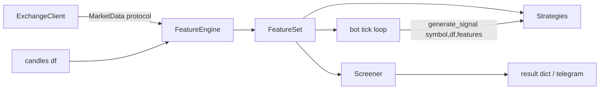

# Architecture — Feature Engine

The market-analysis layer of the trading agent was refactored from inline
indicator code scattered across `MarketData` consumers into a modular
**Feature Engine** (`agent/features/`). Each market signal is now a small,
self-contained *feature*; strategies and the screener consume the resulting
`FeatureSet` instead of recomputing indicators from raw OHLCV.

## Motivation

The old `MarketData` class mixed indicator math with exchange I/O and
produced ad-hoc dicts that were duplicated (momentum recomputed EMAs/RSI,
the screener recomputed its own, the AI strategy recomputed a third time).
That made it hard to keep signals consistent, hard to test, and hard to
extend. The Feature Engine is the single source of truth for indicator
computation.

## Module layout

```
agent/
├── data/market_data.py     # MarketData protocol (fetch_ohlcv/ticker/tickers/
│                           #   order_book/trades/funding_rate)
├── features/
│   ├── base.py             # FeatureResult + BaseFeature (the contract)
│   ├── trend.py            # EMA/RSI/ADX, cross & stack modes
│   ├── volatility.py       # ATR + Bollinger Bands
│   ├── volume.py           # volume ratio + OBV trend
│   ├── liquidity.py        # order-book spread/depth/imbalance   [market]
│   ├── structure.py        # candlestick patterns + S/R levels
│   ├── whale.py            # large-trader flow aggregation        [market]
│   ├── sentiment.py        # smart-money score (book/CVD/OBV)     [market]
│   ├── funding.py          # funding-rate crowd positioning        [market]
│   ├── engine.py           # FeatureSet + FeatureEngine + compute_df_features
│   └── __init__.py         # registry + build_feature_engine factory
├── core/screener.py        # consumes the engine, surface unchanged
├── core/trend.py           # TrendFilter delegates direction() to TrendFeature
└── strategies/*.py         # accept feature_engine=None + features kwarg
```

Features marked `[market]` need live exchange data (`MarketData`). The rest
are `df_only` — computed purely from candles.

## The feature contract

Every feature implements `BaseFeature` and returns an immutable
`FeatureResult`:

```
{
  "<feature_name>": "<signal>",   # e.g. "trend": "bullish"
  "confidence": 0.83,             # 0.0 – 1.0
  "metadata": { ... }             # supporting raw values for consumers
}
```

Rules:

- **Never raises.** Any internal failure degrades to
  `FeatureResult.neutral(...)` (fail-open), matching the codebase's existing
  behavior.
- `df_only` features never touch the network. In `include_market=False`
  mode the engine substitutes a neutral result for every `[market]` feature
  — this is the zero-API-call path used by the live tick loop.
- `metadata` values are the *raw* numbers strategies need (EMA values, BB
  bands, S/R levels, net whale flow…). Strategies read metadata instead of
  recomputing, but **fall back to their own df computation when the config
  differs** from the feature's defaults (e.g. a custom Bollinger period), so
  no behavior is lost.

## Data flow



1. `build_feature_engine(market_data, config)` builds the configured feature
   list (DI — a fake `MarketData` in tests).
2. `engine.compute(symbol, df, include_market=False)` returns a `FeatureSet`
   for the candles only — used in the live tick loop to avoid API calls.
3. `engine.compute(symbol, df, include_market=True)` additionally evaluates
   liquidity/whale/sentiment/funding — used by the screener.
4. `compute_df_features(symbol, df, config)` is the network-free convenience
   entry point (used by legacy `generate_signal(symbol, df)` callers and
   tests).

### Caching

Market-data features are cached per `(symbol, feature)` with a per-feature
`cache_ttl` (liquidity 60s, whale/sentiment 300s, funding 3600s), so the
tick loop and screener don't hammer the exchange. `clear_cache()` resets it.

## Strategies

`BaseStrategy.generate_signal(symbol, df, features=None)` now accepts an
optional `FeatureSet`. Resolution order in `resolve_features`:

1. explicitly-passed `features`, else
2. the injected `feature_engine` (`include_market=False`), else
3. a df-only `FeatureSet` — so legacy two-arg
   `generate_signal(symbol, df)` calls keep working unchanged.

Strategies use feature *events* where available (e.g. momentum reads
`trend.metadata["cross_9_21_event"]` instead of recomputing EMAs) and only
recompute from `df` when their config doesn't match the feature defaults.
`build_strategies(config, exchange, notifier, feature_engine=None)` injects
the engine into every constructed strategy.

## Backward compatibility

- `TrendFilter.direction(symbol)` returns `"LONG"`/`"SHORT"`/`None` exactly
  as before; it now delegates to `TrendFeature`.
- `Screener(exchange, config)` and its result dict
  (`trend/rsi/vol/chg/price/atr/pattern/smart_money`) are unchanged; the
  screener consumes the engine internally.
- `generate_signal(symbol, df)` two-arg calls still work.
- Strategy constructor signatures were extended with an optional
  `feature_engine=None` keyword (positional args unchanged).
- `config.json` without a `features` block defaults cleanly.

## Configuration

See `config.json` → `features` block. Example:

```json
{
  "features": {
    "enabled": ["trend", "volatility", "volume", "liquidity",
                "structure", "whale", "sentiment", "funding"],
    "trend":   { "mode": "ema_cross", "ema_fast": 21, "ema_slow": 50,
                 "adx_enabled": false, "adx_period": 14, "min_adx": 20 },
    "volatility": { "atr_period": 14, "bb_period": 20, "bb_std": 2 },
    "structure":  { "sr_window": 3, "sr_cluster_pct": 0.5, "zone_pct": 0.6 },
    "funding":    { "extreme_rate": 0.0001 }
  }
}
```

## Testing

```
.venv/bin/python -m pytest tests/ -v
```

`tests/test_features/` covers the `FeatureResult` contract, every feature,
engine orchestration/caching, strategy consumption (including parity with
the pre-refactor inline logic) and the backward-compat surfaces
(`TrendFilter`, `Screener`, legacy `generate_signal`).
